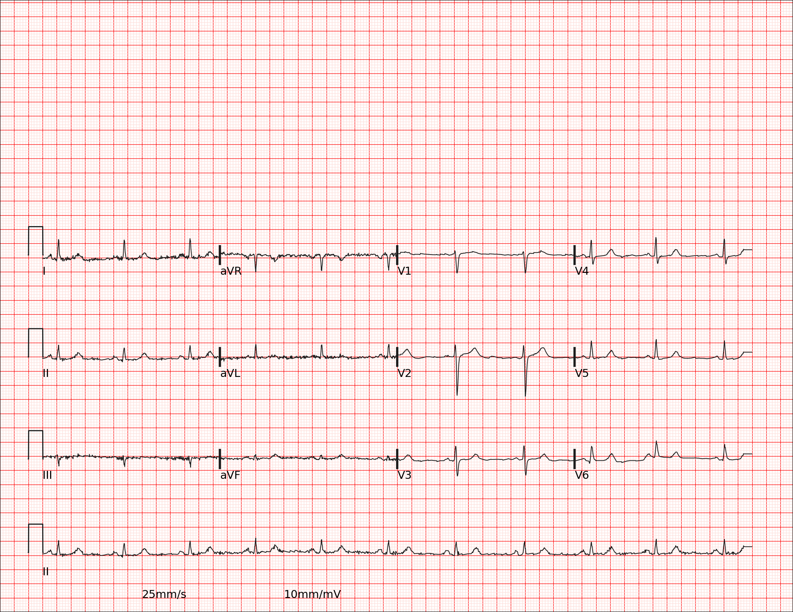

# ECG Lead Detector using YOLOv8

This project trains a YOLOv8 model to detect ECG lead locations from ECG chart images. Useful in digitizing and analyzing clinical ECG data.

## 📦 Model

- **Model**: YOLOv8s (`ultralytics`)
- **Epochs**: 300
- **Image Size**: 640x640
- **Batch Size**: 8
- **Augmentations**: Rotation, scale, shear, mixup, mosaic
- **Optimizer**: AdamW
- **Exports**: TFLite (Android), CoreML (iOS), ONNX, PyTorch

## 🖼 Sample Results

### 🔹 Input ECG Image


### 🔸 YOLOv8 Lead Detection Output (Example of One Lead)


➡️ **Note:**  
This image shows a single lead as an example, but the model is trained to detect **all 12 ECG leads** (I, II, III, aVR, aVL, aVF, V1–V6) in a full ECG chart.  
Each detected region is labeled with its corresponding **lead type**.

## 🏁 Training Command

```python
from ultralytics import YOLO

model = YOLO('yolov8s.pt')
model.train(data='data.yaml', ...)


